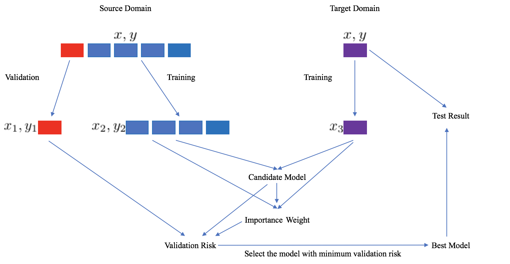

# Deep Embedded Validation

Code release for  **[Towards Accurate Model Selection in Deep Unsupervised Domain Adaptation (ICML 2019)]()** 

## File Structure

- `toy.py`: code for reproducing the experiments in the toy dataset
- `dev.py`: code for calculating the **DEV** risk

## Procedure



The `dev.py:get_weight` can be used to get `importance weight`, and `dev.py:get_dev_risk` can be used to get `validation risk`.

## Citation
please cite:
```
@InProceedings{DEV_2019_ICML,
author = {You, Kaichao and Wang, Ximei and Long, Mingsheng and Jordan, Michael I.},
title = {Towards Accurate Model Selection in Deep Unsupervised Domain Adaptation},
booktitle = {International Conference on Machine Learning (ICML)},
month = {June},
year = {2019}
}
```

## Contact
- youkaichao@gmail.com
- longmingsheng@gmail.com
